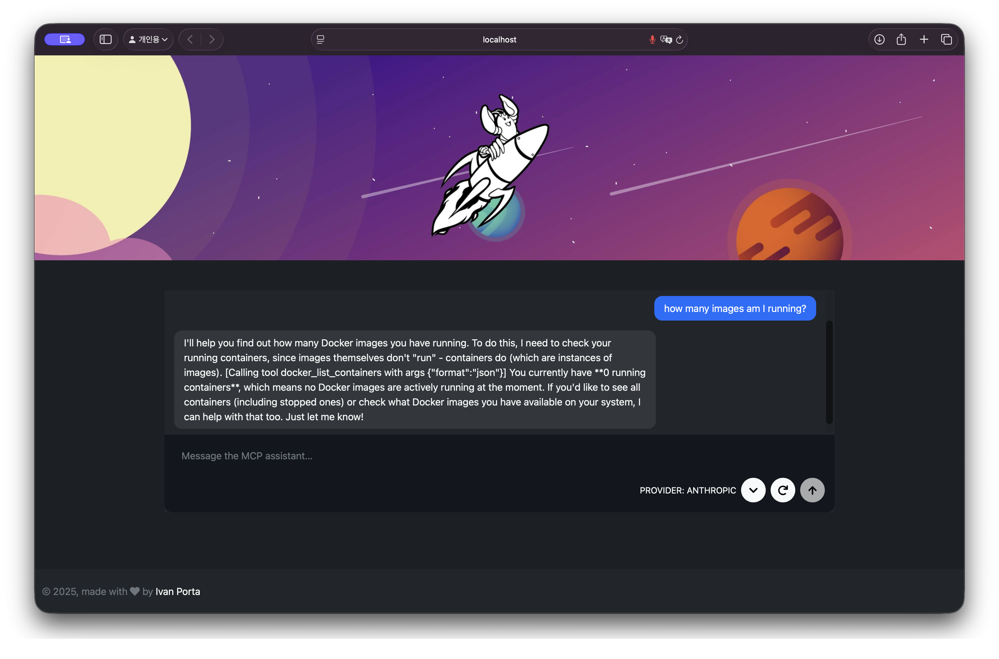

# Vastaya MCP Demo

Vastaya brings together a React-based chat client, a lightweight Express gateway, and sample Model Context Protocol (MCP) servers you can run locally. The web client can talk to MCP servers through either Anthropic or OpenAI models, so you can explore tool calls across providers with the same UI.



---

## Local Testing

### K3D 

```bash
k3d cluster create vastaya --agents 1 --port "8080:80@loadbalancer"
docker build -t vastaya-web:local ./web
docker build -t vastaya-spaceport:local ./servers/spaceport
docker build -t vastaya-fleet:local ./servers/fleet
docker build -t vastaya-universe:local ./servers/universe
docker build -t vastaya-mcp:local ./servers/mcp
docker build -t vastaya-control-tower:local ./servers/control-tower
k3d image import --cluster vastaya \
   vastaya-web:local \
   vastaya-spaceport:local \
   vastaya-fleet:local \
   vastaya-universe:local \
   vastaya-mcp:local \
   vastaya-control-tower:local
helm upgrade --install vastaya ./helm/vastaya \
  --namespace vastaya \
  --create-namespace \
  --set web.image.repository=vastaya-web \
  --set web.image.tag=local \
  --set universe.image.repository=vastaya-universe \
  --set universe.image.tag=local \
  --set fleet.image.repository=vastaya-fleet \
  --set fleet.image.tag=local \
  --set spaceport.image.repository=vastaya-spaceport \
  --set spaceport.image.tag=local \
  --set mcp.image.repository=vastaya-mcp \
  --set mcp.image.tag=local \
  --set controlTower.image.repository=vastaya-control-tower \
  --set controlTower.image.tag=local \
  --set controlTower.googleApiKey=YOUR_GOOGLE_API_KEY \
  --set web.ingress.enabled=true \
  --set 'web.ingress.hosts[0].host=localhost' \
  --set 'web.ingress.hosts[0].paths[0].path=/' \
  --set 'web.ingress.hosts[0].paths[0].pathType=Prefix'
```

Open http://localhost:8080 (via the k3d load balancer) or `kubectl -n vastaya port-forward svc/vastaya-web 8080:80` to reach the UI.

### React front-end (`web/client`)

Requires the Universe, Fleet, Control Tower, and MCP services to be running locally (see sections below). API URLs are configured in `web/client/.env`.

```bash
cd web/client
yarn install
yarn start
```

Visit http://localhost:3000 and exercise the chat, Universe Builder, and fleet tabs

### Universe configuration API (`servers/universe`)

```bash
cd servers/universe
python -m venv .venv && source .venv/bin/activate
pip install -r requirements.txt
uvicorn app:app --reload --port 4005
```

Hit the endpoints directly (e.g. `curl http://localhost:4005/api/universe`) or let the React app call them via `REACT_APP_UNIVERSE_API_BASE_URL`. If you do not have a Kubernetes cluster handy, set `UNIVERSE_APPLY_MODE=dry-run` before calling `/apply`. The API will skip `kubectl apply`, return the rendered manifest (`manifestYaml`), and include a status message instead of failing.

### Fleet mission service (`servers/fleet`)

```bash
cd servers/fleet
python -m venv .venv && source .venv/bin/activate
pip install -r requirements.txt
uvicorn app:app --reload --port 4006
```

Create missions with a POST (the payload mirrors the fleet UI):

```bash
curl -X POST http://localhost:4006/api/fleet/missions \
   -H 'Content-Type: application/json' \
   -d '{"source":{"id":"planet-a"},"destination":{"id":"planet-b"},"rps":100,"speed":"cruise","escortEnabled":true}'
```

Planets poll `/api/fleet/orders?planetId=planet-a` to retrieve actionable missions (RPS, warp speed, and route metadata) and begin issuing traffic.

### Spaceport runtime (`servers/spaceport`)

This FastAPI service is what eventually becomes `ghcr.io/vastaya/spaceport:latest`. It consumes the
environment variables generated by the Spaceport UI (e.g. `CROSS_GALAXY_ENABLED`, `NEBULA_ENABLED`,
`NEBULA_DENSITY`, `CHAOS_EXPERIMENTS_ENABLED`, etc.). When `NEBULA_ENABLED` is `true` the service injects a latency
equal to `NEBULA_DENSITY` milliseconds for most requests. When `CHAOS_EXPERIMENTS_ENABLED` is `true` it randomly
returns HTTP 500 responses to simulate failure injections. The service also fetches the currently scheduled missions
from the Fleet API (configurable through `FLEET_API_BASE_URL`) and surfaces them from its `/status` endpoint.

```bash
cd servers/spaceport
python3 -m venv .venv && source .venv/bin/activate
pip install -r requirements.txt
export NEBULA_ENABLED=true
export NEBULA_DENSITY=125
export CHAOS_EXPERIMENTS_ENABLED=true
export PLANET_ID=planet-a
uvicorn app:app --reload --port 8080
```

Hit `http://localhost:8080/status` to view the combined config + mission snapshot, or `/missions` to proxy the Fleet API. 
Build the production container from this directory (tag however you like): `docker build -t spaceport:latest .` Run it locally

```bash
docker run --rm -p 8080:8080 \
  -e PLANET_ID=planet-a \
  -e PLANET_SERVICE_TEMPLATE=http://host.docker.internal:8080 \
  -e FLEET_API_BASE_URL=http://host.docker.internal:4006/api/fleet \
  spaceport:latest
```

Verify connectivity from inside the container if you still see warnings: docker exec <container> curl -v http://host.docker.internal:4006/api/fleet/orders. 
Create a mission to itself to see that the flow is working.

```bash
curl -X POST http://localhost:4006/api/fleet/missions \
  -H 'Content-Type: application/json' \
  -d '{
        "source": {"id": "planet-a"},
        "destination": {"id": "planet-a"},
        "rps": 25,
        "speed": "cruise",
        "escortEnabled": true
      }'
```

### Control Tower (`servers/control-tower`)

Translates chat requests from the React UI to the configured LLM (Google Gemini by default) and routes tool calls through the MCP server.

```bash
cd servers/control-tower
python3 -m venv .venv && source .venv/bin/activate
pip install -r requirements.txt
cp .env.example .env  # then fill in your GOOGLE_API_KEY
uvicorn app:app --port 3100
```

### MCP agent (`servers/mcp`)

Hosts the FastMCP server and Google ADK agents (fleet and universe). Listens on port 3002 by default so it can run alongside the React dev server on port 3000; override `MCP_PORT` if needed.

```bash
cd servers/mcp
python3 -m venv .venv && source .venv/bin/activate
pip install -r requirements.txt
# copy and fill in GOOGLE_API_KEY for each sub-agent
cp fleet_agent/.env.example fleet_agent/.env
cp universe_agent/.env.example universe_agent/.env
python3 server.py
```

To exercise the agents interactively with the Google ADK web harness:

```bash
cd servers/mcp
source fleet_agent/.env
adk web
```

Open the printed URL and issue queries such as “List the current missions”, “Create a mission from planet-a to planet-b at 200 RPS”, or “Destroy all planets”. Each tool call hits the local FastAPI services.

#### MCP resources

- The MCP server exposes `vastaya://planets`, returning the live planet list from the Universe API.
- Local MCP-aware clients (e.g., Claude Desktop or the `use-mcp` hook) can auto-register the server via `.mcp/servers.json`. If your client supports it, point it at that file or copy the entry; it starts `python3 servers/mcp/server.py` with the correct env defaults.

---

## Architecture & Service Dependencies

### Service map

```
Browser
  │
  │  HTTP (port 8080 via K3D load balancer)
  ▼
Ingress (Traefik)
  ├── /              → vastaya-web       :80    React SPA + Express
  ├── /api/universe  → vastaya-universe  :4005  Universe config API
  ├── /api/fleet     → vastaya-fleet     :4006  Fleet mission API
  ├── /api/spaceport → vastaya-spaceport :8080  Spaceport runtime
  ├── /mcp           → vastaya-mcp       :3002  MCP agent server
  └── /chat          → vastaya-control-tower :3100  LLM gateway
```

### Call graph

```
React UI
  ├── GET/POST /api/universe  ──────────────────────────► Universe API
  ├── GET/POST /api/fleet     ──────────────────────────► Fleet API
  └── POST     /chat          ──► Control Tower
                                      │ sync / streaming
                                      ▼
                                  MCP Server
                                  ├── universe_agent ──► Universe API
                                  └── fleet_agent    ──► Fleet API

Spaceport (each planet instance)
  ├── polls GET /api/fleet/orders  ──► Fleet API   (async, every 5 s)
  └── POST  /dock                  ──► other Spaceport instances
```

### Coupling table

| Caller | Callee | Style | Timeout | Fails if callee is down? |
|---|---|---|---|---|
| Control Tower | MCP Server | sync / streaming | none | yes — chat unavailable |
| MCP Server | Universe API | sync | 10 s | yes — universe tools fail |
| MCP Server | Fleet API | sync | 10 s | yes — fleet tools fail |
| Spaceport | Fleet API | async polling | 5 s | no — logs error, retries |
| Spaceport | Other planets | async burst | 5–60 s | no — per-burst failure logged |

**Universe API** and **Fleet API** are fully self-contained — they make no outbound calls and can run independently of every other service.

The tight chain **Control Tower → MCP → APIs** is intrinsic to the agentic tool-calling pattern: the LLM must wait for tool results before it can respond. Adding timeouts and circuit breakers on the MCP → API calls is the most impactful hardening step for production use.

---

## License

Refer to the individual directories for licensing terms. The Docker MCP server ships with its own license file; the rest of the repository follows the included licenses.
