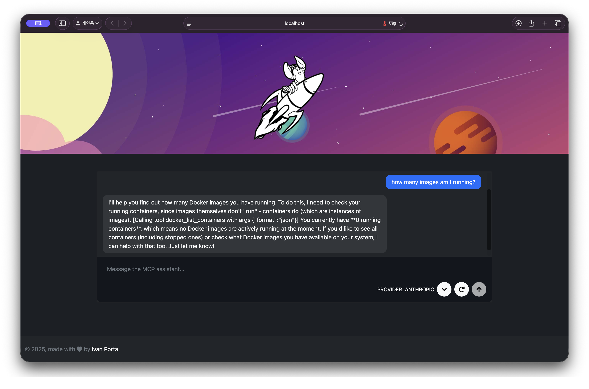

# Vastaya MCP Demo

Vastaya brings together a React-based chat client, a lightweight Express gateway, and sample Model Context Protocol (MCP) servers you can run locally. The web client can talk to MCP servers through either Anthropic or OpenAI models, so you can explore tool calls across providers with the same UI.



---

## What’s in the Repository

```
web/
  client/    React SPA that drives the MCP chat experience
  server/    Express server for production builds and /api proxying
servers/
  weather/   HTTP MCP server backed by the National Weather Service API
  docker/    HTTP MCP server that wraps the local Docker CLI
web/Dockerfile  Multi-stage build that produces a runnable container image
```

---

## Prerequisites

- Node.js 18+ and npm (for the React client and both MCP servers)
- Docker (only required when you plan to use the Docker MCP server)
- Anthropic and/or OpenAI API keys:
  - `REACT_APP_ANTHROPIC_API_KEY`
  - `REACT_APP_OPENAI_API_KEY`

Both keys are optional individually, but you need at least one to issue model calls from the chat UI.

---

## Getting Started

### 1. Configure the Client Environment

Create `web/client/.env` or `web/client/.env.local` with the values you need. The current defaults target the Docker MCP server:

```ini
REACT_APP_MCP_SERVER_URL=http://localhost:3002/mcp
REACT_APP_ANTHROPIC_API_KEY=your-anthropic-key
REACT_APP_OPENAI_API_KEY=your-openai-key
```

If you prefer the Weather MCP server, change the server URL to `http://localhost:3001/mcp`. `.env.local` stays out of version control, so it’s the safest place for secrets.

### 2. Install and Run the React Dev Server

```bash
cd web/client
npm install
npm start
```

The development server runs on `http://localhost:3000`. The chat widget connects to the MCP endpoint set in `REACT_APP_MCP_SERVER_URL`, and you can switch between Anthropic and OpenAI with the provider dropdown inside the app.

### 3. Launch an MCP Server

Pick whichever backend you want to explore (running both is fine too):

#### Weather MCP Server

```bash
cd servers/weather
npm install
npm start    # serves on http://localhost:3001/mcp by default
```

Tools available:

- `get_alerts` — active US weather alerts by two-letter state code
- `get_forecast` — forecast for a latitude/longitude within the US

#### Docker MCP Server

```bash
cd servers/docker
npm install
npm start    # serves on http://localhost:3002/mcp by default
```

Tools cover common Docker workflows: list containers/images, fetch logs, run/stop/remove containers, prune resources, inspect objects, and invoke `docker compose` subcommands. Ensure the local Docker daemon is running and your user can access it.

---

## Building for Production

1. Compile the React app:

   ```bash
   cd web/client
   npm run build
   ```

2. Serve the build with the Express gateway:

   ```bash
   cd ../server
   npm install
   PORT=8080 node index.js   # change PORT if you prefer
   ```

   The gateway serves `../build` and exposes `/api` endpoints that proxy to backing services. Override the defaults with environment variables:

   - `GALAXIES_URL` (defaults to `http://galaxies-svc.vastaya.svc.cluster.local:8081`)
   - `PLANETS_URL` (defaults to `http://planets-svc.vastaya.svc.cluster.local:8082`)

3. Alternatively, build and run the container image defined in `web/Dockerfile`, which bundles the compiled client and the Express gateway in a single image.

---

## Tips

- The chat keeps the last conversation per provider; use the refresh icon to reset the session when switching contexts.
- Each provider maintains its own MCP connection. Switching models triggers a clean disconnect/reconnect so tool state stays isolated.
- You can point the client at any MCP-compliant HTTP endpoint—just update `REACT_APP_MCP_SERVER_URL`.

---

## License

Refer to the individual directories for licensing terms. The Docker MCP server ships with its own license file; the rest of the repository follows the included licenses.
